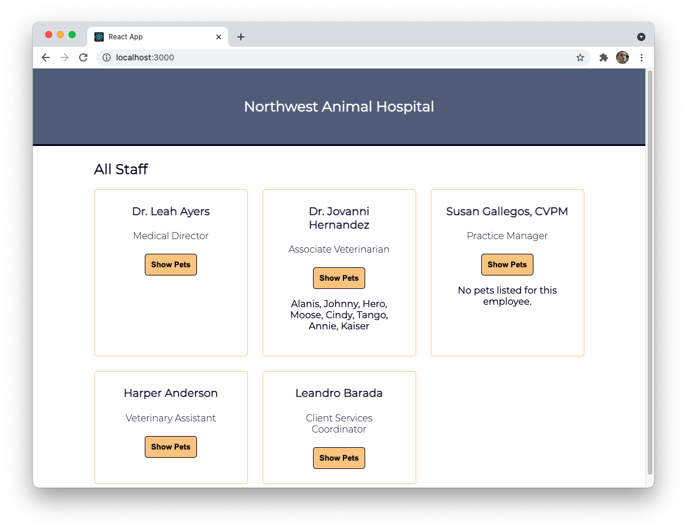

# React Lifecycle (useEffect) Lab

In this lab, you will build a simple page that will show all of the employees at a local veterinarian hospital by accessing an external API. Then, you will make it so that, by clicking a button, the pets each doctor sees at the hospital appear.



---

## Lab Setup

### Getting started

1. Fork and clone this repository.

1. Navigate to the cloned repository's directory on your command line. Then, run the following command:

   ```
   npm install
   ```

   This will install the libraries needed.

1. Open up the repository in VSCode. Follow the instructions below to complete the Lab.

1. Deploy this application to Netlify and add the link to your netlify site below:

- [MY LIVE SITE URL]()

## Instructions

Making use of the existing code, add the following features to the React application. Details about the API you will be accessing are included below.

_\*\*Use the image above as a reference._

- [ ] Instead of showing a hardcoded staff member, dynamically build a list of staff members by accessing the external API.
  - [ ] If the staff member has a `prefix`, like `"Dr."`, include it at the beginning of the name. (E.g. "Dr. Leah Ayers")
  - [ ] If the staff members has a `postfix`, like `"CVPM"`, include it at the end of the name with a comma. (E.g. "Susan Gallegos, CVPM")
- [ ] Upon clicking the "Show Pets" button, the name of the pets the staff members sees should be shown below the button.
  - You only need to include the `names` of the pets as a comma-separated list.

There are multiple ways to accomplish the above goals.

You _should not_ change the overall component hierarchy in this application.

### Using the API

The URL for the API you will be accessing is `https://resource-veterinarian-api-4guj.onrender.com`.

You will need to hit two endpoints:

#### `/api/employees`

(e.g. `https://resource-veterinarian-api-4guj.onrender.com/api/employees`)

Making a GET request to this path will return an array of employees. The response will look similar to the one below.

```js
[
  {
    id: "z7GIN_i",
    firstName: "Leah",
    lastName: "Ayers",
    prefix: "Dr.",
    postfix: "",
    title: "Medical Director"
  }
  // ...
];
```

#### `/api/pets`

(e.g. `https://resource-veterinarian-api-4guj.onrender.com/api/pets`)

Making a GET request to this path will return an array of pets. The response will look similar to the one below.

```js
[
  {
    id: "dGXf5O9",
    name: "Lady",
    kind: "Dog",
    breed: "Doberman Pinscher",
    employeeId: "z7GIN_i"
  }
  // ...
];
```

Each pet has an `employeeId` key which matches one employee's `id`. This represents which staff member is overseeing the pet.

Alternaitively, you can specifically look for pets with an ID that matches an employee. For example, take a look at the following path and response.

**Request Path:**

- `/api/pets?employeeId=vlJtFOU`

**Response Body:**

```js
[
  {
    id: "fiQ_EZE",
    name: "Alanis",
    kind: "Dog",
    breed: "Retriever, Labrador",
    employeeId: "vlJtFOU"
  }
  // ...
];
```

In the example above, the employee ID of `vlJtFOU` was included as part of the path. Only those pets with an `employeeId` that is equal to that ID are then returned.

There are several ways to solve this exercise, but remember, it is always preferable and less expensive to hit the api endpoints as few times as possible.
